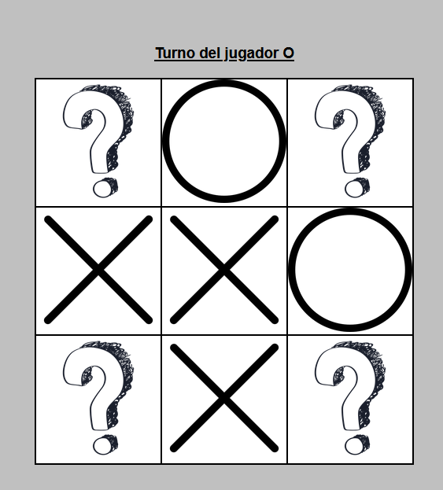

# TresEnRaya

This is a js project based on tic tac toe game.

## Table of contents

- [Description](#description)
- [Technologies](#technologies)
- [Installation](#installation)

## Description

This is a js project based on tic tac toe game. The game is designed to play against a friend in 1vs1 mode. The first to reach the combination of 3 images either horizontally, vertically or diagonally wins the game.

## Technologies

The project has been created with:

- HTML
- CSS
- JS

## Installation

To run this project, we need the following steps:

- Download and install vscode at the following link: https://code.visualstudio.com/download

- Download the Live Server extension, which is found in the vscode editor

- Once the extension is downloaded, run the extension and everything will work correctly
